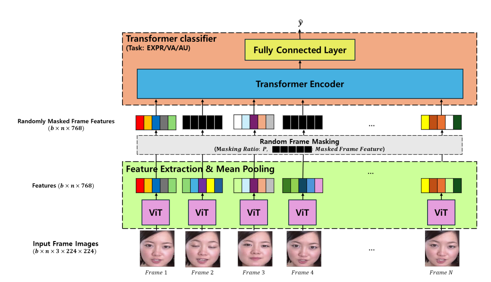
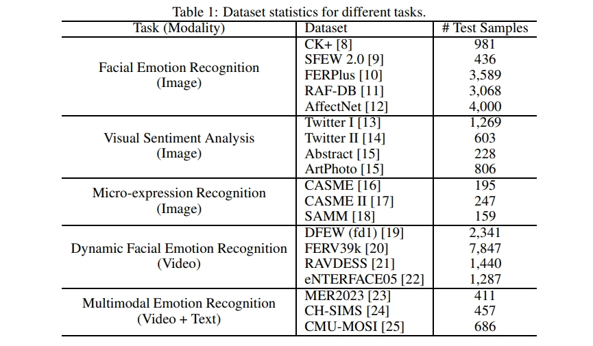

## Literature Review

### Emotion Recognition using Transformers with Masked Learning
**Link:** https://arxiv.org/abs/2403.13731  
**Code:** https://github.com/msjae/ABAW  
**Summary:** 
This paper leverages the vision transformer models to focus on the estimation of Valence-arousal - which signifies the positivity and intensity of emotions, recognition of various facial features, and detection of Action Units (AU) representing fundamental muscle movements. This research includes a new training technique applied through random frame masking.

### GPT-4V with emotion: A zero-shot benchmark for Generalized Emotion Recognition
**Link:** https://www.sciencedirect.com/science/article/pii/S1566253524001453 
**Code:** https://github.com/zeroQiaoba/gpt4v-emotion 
**Summary:** 
This paper provides quantitative evaluation results of GPT-4V on 21 benchmark datasets covering 6 tasks - 
visual sentiment analysis, tweet sentiment analysis, micro-expression recognition, facial emotion recognition, multimodal emotion recognition and dynamic facial emotion recognition. 
