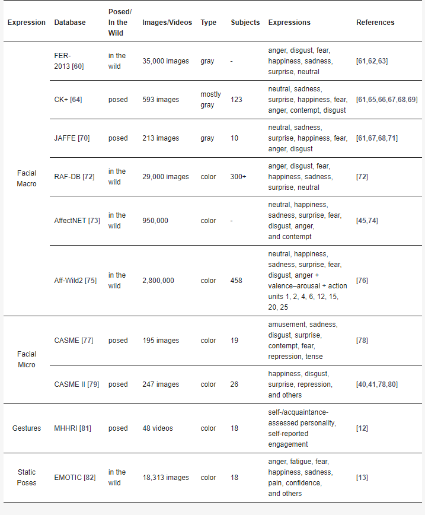
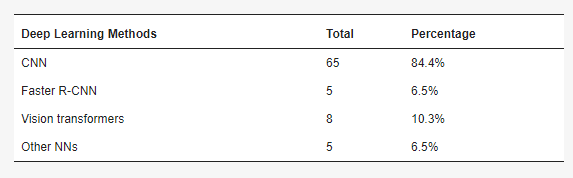

## Literature Review

### 1) Systematic Review of Emotion Detection with Computer Vision and Deep Learning
**Link:** https://www.mdpi.com/1424-8220/24/11/3484 
**Summary**: 
This survey evaluates 77 papers from different sources about facial and pose emotion recognition using DL and computer vision. It addressed the following questions - 1) What types of emotion expressions are addressed in the literature. 2) What are the deep learning methods utilized 3) Which datasets are employed by relevant works? 4) Which performance improvement techniques can be employed in this context?

#### Common Datasets

#### Deep Learning Methods Utilized

### 2) A study on computer vision for facial emotion recognition
**Link:** https://www.nature.com/articles/s41598-023-35446-4 
**Summary:** 
In this study squeeze and excitation module was used with ResNet-18 to achieve a relatively light model for facial emotion recognition. This model has 11.27 million trainable parameters. (Compared to 23 million of ResNet and 86 million of vision transformer) The dataset used is AffectNet dataset. 

### 3) Vision-enabled Large Language and Deep Learning models for Image-based emotion recognition
**Link:** https://link.springer.com/article/10.1007/s12559-024-10281-5 
**Summary:** 
The paper discusses significant advancements in AI tools, particularly large language models (LLMs) like GPT-3.5, GPT-4, and Bard, which are now capable of processing multimodal inputs including text, images, and audio. It compares the performance of fine-tuned deep learning models (DLMs) like CNNs, ResNet50, and VGG-16 with general-purpose LLMs for image-based emotion recognition tasks2. The study found that while LLMs did not outperform specialized models, they achieved comparable performance, making them viable for specific tasks without additional training3. GPT-4 showed better performance with small datasets, suggesting that LLMs can be a good alternative when the available dataset is limited4.

### 4) Contextual Emotion Recognition using Large Vision Models 
**Link:** https://arxiv.org/pdf/2405.08992 
**Summary:** 
The paper discusses the challenge of recognizing emotions in real-world situations, emphasizing the need for body pose, contextual knowledge, and commonsense reasoning beyond facial expressions.Two major approaches using large vision language models are evaluated:
1) Image Captioning + LLM: This involves generating image captions followed by language-only large language model (LLM) analysis.
2) Vision Language Models (VLMs): These models are assessed under zero-shot and fine-tuned setups.

The methods are tested on the Emotions in Context (EMOTIC) dataset, which includes contextual and environmental factors in emotion recognition. The study finds that a fine-tuned vision language model significantly outperforms traditional baselines, suggesting potential for future emotionally sensitive decision-making and interaction in robotics2.

### 5) Emotion Recognition using Transformers with Masked Learning
**Link:** https://arxiv.org/abs/2403.13731  
**Code:** https://github.com/msjae/ABAW  
**Summary:** 
This paper leverages the vision transformer models to focus on the estimation of Valence-arousal - which signifies the positivity and intensity of emotions, recognition of various facial features, and detection of Action Units (AU) representing fundamental muscle movements. This research includes a new training technique applied through random frame masking.

### 6) GPT-4V with emotion: A zero-shot benchmark for Generalized Emotion Recognition
**Link:** https://www.sciencedirect.com/science/article/pii/S1566253524001453 
**Code:** https://github.com/zeroQiaoba/gpt4v-emotion 
**Summary:** 
This paper provides quantitative evaluation results of GPT-4V on 21 benchmark datasets covering 6 tasks - 
visual sentiment analysis, tweet sentiment analysis, micro-expression recognition, facial emotion recognition, multimodal emotion recognition and dynamic facial emotion recognition. 
